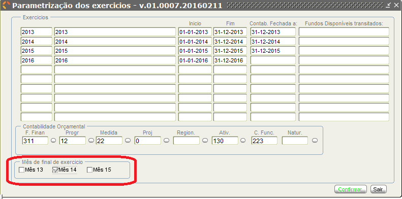
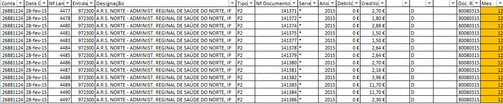
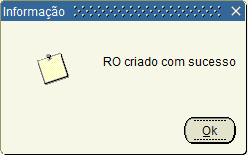

# Gestão de Exercícios

``Os direitos de autor deste trabalho pertencem à SPMS e a informação nele contida é confidencial.``

``Este trabalho não pode ser reproduzido ou divulgado, na íntegra ou em parte, a terceiros nem utilizado para outros fins que não aqueles para que foi fornecido sem a autorização escrita prévia ou, se alguma parte do mesmo for fornecida por virtude de um contrato com terceiros, segundo autorização expressa de acordo com esse contrato. Todos os outros direitos e marcas são reconhecidos.``

``As cópias impressas não assinadas representam versões não controladas. ``

---

# Índice

1. [Introdução](#introducao)
2. [Abertura e encerramento de períodos contabilísticos](#abertura_encerramento_periodos_contabilisticos)
3. [Produção de extrato de contas](#producao_extrato_contas)
4. [Apuramento de resultados](#apuramento_resultados)

___

# 1. Introdução

Surge a necessidade de com o presente manual demonstrar as operações que permitem definir os períodos contabilísticos para cada organismo, isto é, definir o período do ano fiscal disponível para efetuar lançamentos contabilísticos.

Podem ser abertos, em simultâneo, vários períodos contabilísticos. Geralmente, apenas o período corrente (e eventualmente o período anterior) fica em aberto e todos os restantes estão fechados. No final do período, este é fechado e o período seguinte encontra-se em aberto.

Períodos especiais podem ser abertos, para fecho de contas, durante o encerramento do exercício.

# 2. Abertura e encerramento de períodos contabilísticos

A parametrização dos exercícios serve de elemento agregador de todo o processo de fecho de ano na contabilidade.

A abertura do período contabilístico é efetuada no início do ano económico, sendo que a sua data de início é a 01-01-20XX e a sua data final a 31-12-20XX.
Neste menu, são parametrizados os dados a usar no fecho do ano (Identifica e correlaciona o Organismo com o exercício que vai ser encerrado). Os lançamentos de encerramento de exercício na contabilidade deverão ser efetuados nos períodos extraordinários:

- Mês 13 – Registos posteriores aos registos provisórios;
- Mês 14 – Regularizações;
- Mês 15 – Apuramento;

Após o encerramento do mês 13, o mesmo procedimento tem de ser feito para o mês 14, no qual deverá conter a data contabilística do último dia do último mês do exercício. Igualmente, o processo é realizado para o mês 15 (apuramento de resultados), demostrado no capítulo 4 do presente manual.

# 3. Produção de extrato de contas

Neste capítulo, será demonstrada a produção do ficheiro de extrato de contas, evidenciando igualmente a qual o período que se refere, sendo que para o efeito usaremos uma conta específica a título de exemplo.

**Menu:**

**Submenu:**

Foi adicionado ao ficheiro produzido em csv., a possibilidade de o Utilizador verificar em que mês os documentos foram inseridos.

Os meses 13, 14 e 15 devem sempre ter data contabilística do ultimo mês do exercício, isto é, em 2015 o ultimo mês terá de ser Dezembro, não podendo as situações abaixo demonstradas:

# 4. Apuramento de resultados

Para o apuramento do resultado Líquido do exercício (RLE) concorrem todos os custos e perdas e todos os proveitos e ganhos reconhecidos no período respetivo.
Desta forma e através do menu abaixo indicado, é efetuado o processamento de apuramento, sendo que o período deverá ser sempre o mês 15 (SICC valida a data deste registo).

No Sistema SICC, a execução do apuramento é efetuada através de um submenu das recolhas, conforme abaixo demonstrado:

O RLE é constituído pelos seguintes componentes:

### Resultados Operacionais

### Resultados Financeiros

### Resultados Correntes

### Resultados Extraordinários

### Imposto sobre o rendimento do exercício

### Resultados Líquidos

**Esquematizando:**

O processo de “abater” qualquer um destes resultados, tem obrigatoriamente que obedecer à ordem inversa da altura da criação, sendo que:

- Abater RL (Resultados Líquidos)
- Abater RI (Resultados antes de imposto)
- Abater RE (Resultados Extraordinários)
- Abater RC (Resultados Correntes)
- Abater RF (Resultados Financeiros)
- Abater RO (Resultados Operacionais)

